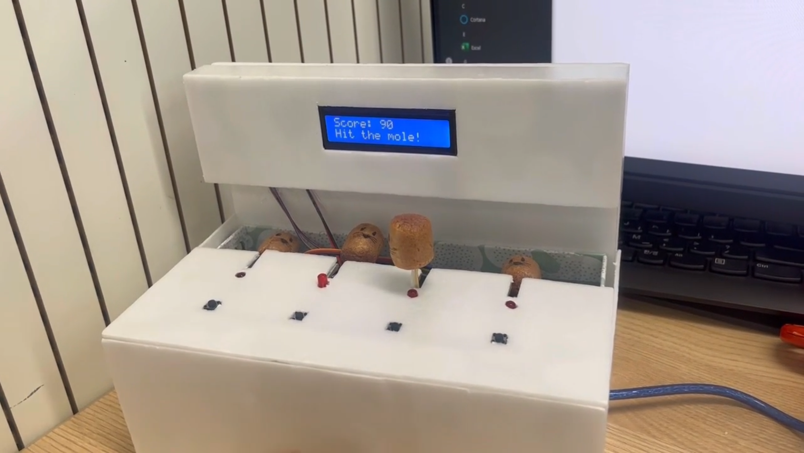

# 🔨 아두이노 기반 인터랙티브 두더지 게임 (Whack-A-Mole)

사용자의 반응 속도 향상과 몰입도 높은 경험을 위해 설계된 **IoT 인터랙티브 시스템**입니다. 
서보모터, 센서, LCD를 통합 제어하여 점진적인 난이도 상승과 실시간 피드백을 제공합니다.

## 1. 개발 목표 및 특징
- **인터랙티브 경험:** LED, 부저, LCD를 활용한 시청각 피드백 제공.
- **난이도 설계:** 총 3단계로 구성되며, 단계별로 두더지 출현 속도가 빨라지고 방해 요소(LED)가 추가됩니다.
- **학습 효과:** 단순 게임을 넘어 반응 속도 및 집중력 테스트 도구로 활용 가능합니다.

## 2. 주요 기술 스택 및 하드웨어 구성

### 🛠 하드웨어 (H/W)
| 분류 | 부품명 | 수량 | 주요 역할 |
| :--- | :--- | :---: | :--- |
| **Main** | Arduino UNO | 1 | 전체 시스템 로직 및 센서/액추에이터 제어 |
| **Actuator** | SG90 Servo Motor | 4 | 두더지 캐릭터의 상하 움직임(Pop-up) 구현 |
| **Actuator** | Passive Buzzer | 1 | 게임 시작, 정답/오답, 종료 시 효과음 출력 |
| **Sensor** | Tact Switch | 4 | 사용자의 두더지 타격 입력 감지 |
| **Display** | I2C LCD (16x2) | 1 | 실시간 점수, 스테이지, 안내 메시지 시각화 |
| **Indicator** | LED | 4 | 3단계 난이도의 시각적 방해 요소 및 상태 피드백 |

### 💻 소프트웨어 (S/W)
- **Language:** C/C++ (Arduino Sketch)
- **Libraries:** `Servo.h`, `LiquidCrystal_I2C.h`

## 3. 핵심 게임 로직 및 완성 결과
- **스테이지 구성:**
  - **1단계:** 3초 간격 (50점 합격 시 다음 단계 이동)
  - **2단계:** 1.5초 간격 (100점 합격 시 다음 단계 이동)
  - **3단계:** 1.5초 간격 + **LED 방해 모드 활성화**
- **판정 시스템:** 정답(+10점), 오답(-5점) 처리 및 LCD 실시간 반영.

### 📺 프로젝트 결과물

---

## 📂 프로젝트 결과물 확인
* 📄 **상세 개발 보고서:** [두더지게임_개발보고서.pdf](./두더지게임_개발보고서.pdf)
* 🎥 **프로젝트 구현 영상:** [시연 영상 확인하기](./videos/demo_play.mp4)
* 📅 **주간 진행 기록:** [reports 폴더 바로가기](./reports/)
